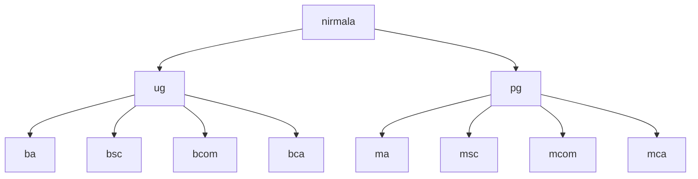

# Sem 4

## Web Development Record Programs

**Using HTML, CSS, JavaScript and PHP.**

*HTML, CSS and JavaScript programs may be previewed directly from this repo*

### HTML & CSS

1. **HTML webpage for college (using lists)**
   - [Code](./web/collegeWebpage/index.html)
   - [Preview](https://shonebinu.github.io/collegeCurriculum/sem4/web/collegeWebpage/index.html)
2. **HTML webpage to display Time Table (using table)**
   - [Code](./web/timeTable/index.html)
   - [Preview](https://shonebinu.github.io/collegeCurriculum/sem4/web/timeTable/index.html)

---

## Linux Record Programs
*Note: The scripts given here are for `bash` interpreter*

### Directory Related Commands
1. **Create the following directory structure**

```bash
mkdir -p nirmala/{ug/{ba,bsc,bcom,bca},pg/{ma,msc,mcom,mca}} #you could also expand it
```

2. **Remove the directory `bcom`**
```bash
rmdir nirmala/ug/bcom
```

3. **Change to parent directory**
```
cd ..
```

4. **Display the contents of current directory in detail**
```
ls -al 
```

5. **Display the current path**
```
pwd 
```

6. **Change the name of bca to nbca**
```
mv nirmala/ug/bca nirmala/ug/nbca
```

### File Related Commands
1. **Change to `nbca`**
```bash
cd nirmala/ug/nbca
```
