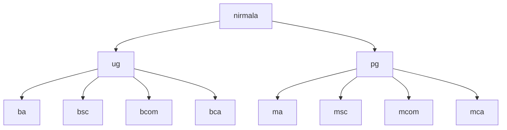

# Sem 4

## Web Development Record Programs
*Using HTML, CSS, JavaScript and PHP.*

1. **HTML webpage for college (using lists)**
   - [Code](./web/collegeWebpage/index.html)
   - [Preview](https://shonebinu.github.io/collegeCurriculum/sem4/web/collegeWebpage/index.html)
2. **HTML webpage to display Time Table (using table)**
   - [Code](./web/timeTable/index.html)
   - [Preview](https://shonebinu.github.io/collegeCurriculum/sem4/web/timeTable/index.html)
3. **Registration Form using HTML and CSS**
   - [Code](./web/registrationForm/index.html)
   - [Preview](https://shonebinu.github.io/collegeCurriculum/sem4/web/registrationForm/index.html)
4. **JavaScript program to calculate sum and product of two numbers using functions**
   - [Code](./web/jsFunction/index.html)
   - [Preview](https://shonebinu.github.io/collegeCurriculum/sem4/web/jsFunction/index.html)

---

## Linux Record Programs
*Note: The scripts given here are for `bash` interpreter*

### Directory Related Commands

1. **Create the following directory structure**

```bash
mkdir -p nirmala/{ug/{ba,bsc,bcom,bca},pg/{ma,msc,mcom,mca}} #you could also expand it
```

2. **Remove the directory `bcom`**
```bash
rmdir nirmala/ug/bcom
```

3. **Change to parent directory**
```bash
cd ..
```

4. **Display the contents of current directory in detail**
```bash
ls -al 
```

5. **Display the current path**
```bash
pwd 
```

6. **Change the name of bca to nbca**
```bash
mv nirmala/ug/bca nirmala/ug/nbca
```

### File Related Commands
1. **Change to `nbca`**
```bash
cd nirmala/ug/nbca
```

2. **Create file `bcastudent`**
```bash
cat > bcastudents #a blank cursor will appear, and type what you want to store, Ctrl+c to exit and save
```

3. **Sort the names in `bcastudents`**
```bash
sort bcastudents 
```

4. **Create a file in `mca` directory and after that display the sorted content**
```bash
cd ../../pg/mca 
cat > mcastudents
sort mcastudents
```

5. **Append into `bcastudents`**
```bash
cd ../../ug/nbca
cat >> bcastudents #append to the file
cat bcastudents #print the whole file
```

6. **Search for a particular data in `bcastudents`**
```bash
grep "keyword" bcastudents
```

7. **Display all files including hidden**
```bash
ls -a
```

8. **Count the number of lines in `bcastudents`**
```bash
wc -l bcastudents
```

9. **Translate the lowercase letters into uppercase letters in `bcastudents`**
```bash
cat bcastudents | tr "[a-z]" "[A-Z]"
```

10. **Implement `pr` command**
```bash
pr bcastudents
```

11. **Create files `f1`, `f2`, `f3`, `f4` in nbca**
```bash
cat >> f1
cat >> f2
cat >> f3
cat >> f4
```

12. **Implement `find` command**
```bash
find -name f1 -print
```

13. **Delete file `f4`**
```bash
rm f4
```

14. **Create a file `f5` and implement cut command**
```bash
cat >> f5
cut -c 1,2 f5
```

15. **Implement `head` and `tail`**
```bash
head -2 bcastudents
tail -2 bcastudents
```

16. **Implement `file` command**
```bash
file *
```

17. **File comparison**
```bash
cmp f1 f2
diff f1 f2
```

18. **Implement `chmod` command**
```bash
chmod 777 f5
```

### Mathematical Commands
1. **Workout various mathematical commands**
```bash
bc #ctrl+d to exit
expr 2 + 5 #space is needed between operands and operator
factor 49
```

### Miscellaneous Commands
1. **Implement the working of `ls` command**
```bash
cd ..
touch f1 f2
ls
ls f*
ls f?
ls b*
```

2. **Implement various system related commands**
```bash
uname
who
who am i
hostname
```

3. **Get the shell details**
```bash
echo $0
cat /etc/shells
echo $PATH
```

4. **Get terminal name**
```bash
tty
```

5. **Get primary prompt**
```bash
echo $PS1
```

6. **Get secondary prompt**
```bash
echo $PS2
```

### Date Command
1. **Implement `cal` command**
```bash
cal
```

2. **Display current time and date**
```bash
date
```

3. **Get current date**
```bash
date "+%D"
```

4. **Get current day**
```bash
date "+%A"
```

5. **Get current month**
```bash
date "+%h"
```

6. **Get last 2 digits of current year**
```bash
date "+%y"
```

7. **Get current year**
```bash
date "+%Y"
```

8. **Get current time**
```bash
date "+%T"
```

9. **Get current hour**
```bash
date "+%H"
```

10. **Get current minute**
```bash
date "+%M"
```

11. **Get current second**
```bash
date "+%S"
```

### Disk related command
```bash
df
du
```

### PS Command
1. **Get the details of processes**
```bash
ps
```

### TEE command
1. **Redirect the output of a process into another file**
```bash
ls -l | tee f1
```

### Other Commands
1. **Get the login name of the user**
```bash
logname
```

2. **Redirect error into a file**
```bash
las -l 2> f5
cat f5
```

### VI EDITOR
1. **Create a file `f1` and save content into it and quit**
```bash
vi f1
:wq
```

2. **Open the same file and copy the first line and paste it into third line**
```bash
vi f1
:1co3
```

3. **Delete the second and third line**
```bash
:2,3d
```

4. **Delete a word from current position**
```bash
dw
```

5. **Save and Exit from the file**
```bash
:wq
```
