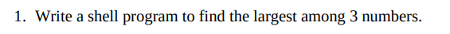
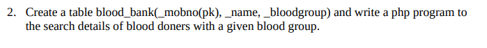
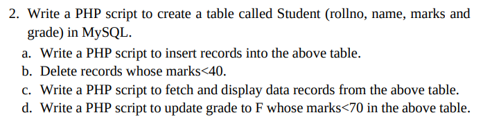
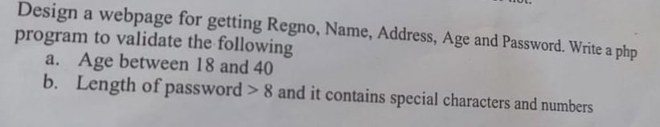

# Sem 4

## Record Programs

### Web Development Record Programs
*Using HTML, CSS, JavaScript and PHP.*

1. **HTML webpage for college (using lists)**
   - [Code](./web/collegeWebpage/index.html)
   - [Preview](https://shonebinu.github.io/collegeCurriculum/sem4/web/collegeWebpage/index.html)
2. **HTML webpage to display Time Table (using table)**
   - [Code](./web/timeTable/index.html)
   - [Preview](https://shonebinu.github.io/collegeCurriculum/sem4/web/timeTable/index.html)
3. **Registration Form using HTML and CSS**
   - [Code](./web/registrationForm/index.html)
   - [Preview](https://shonebinu.github.io/collegeCurriculum/sem4/web/registrationForm/index.html)
4. **JavaScript program to calculate sum and product of two numbers using functions**
   - [Code](./web/jsFunction/index.html)
   - [Preview](https://shonebinu.github.io/collegeCurriculum/sem4/web/jsFunction/index.html)
5. **JavaScript program to illustrate various JS Events**
   - [Code](./web/jsEvents/index.html)
   - [Preview](https://shonebinu.github.io/collegeCurriculum/sem4/web/jsEvents/index.html)
6. **JavaScript program to illustrate JS validations**
   - [Code](./web/jsValidations/index.html)
   - [Preview](https://shonebinu.github.io/collegeCurriculum/sem4/web/jsValidations/index.html)
7. [**PHP program to find factorial**](./web/factorial)
8. [**PHP program to find length, reverse, uppercase and lowercase of a string**](./web/stringOperations)
9. [**PHP program to validate email**](./web/emailValidation)
10. [**PHP program to validate age(b/w 18 and 40) and password(length > 8, contain numbers and special characters)**](./web/passAndAgeValidation)
11. [**PHP program to validate name, address, dob, gender & mobile of an Application Form**](./web/applicationForm)
12. [**PHP program to record student details if and only if the student is 18 years old or more**](./web/studentAge)
13. [**PHP program to insert records of employee and display the record**](./web/employee)
14. [**PHP program to search an employee with name and update the details**](./web/employeeSearch)
15. [**PHP program to insert book(id, title, author, price) and to display all distinct titles, when clicked on the title, it should show a page with the same book details**](./web/book)
16. [**Create a table login(username, password, role, visit_count), role must be either admin or user. PHP program to login with valid username and password, and update visit_count on each visit. Redirect to different pages based on the role**](./web/login)


### Linux Record Programs
*Note: The scripts given here are for `bash` interpreter*

#### Bash Commands
[Bash commands README](./linux/bashCommandREADME.md)

### Bash Scripts
*The curriculum follows the following syntax to execute the scipts.*
```bash
sh PROGRAM.sh
```
1. [Write a shell program to add 2 numbers using command line arguments](./linux/add2Nums.sh)

2. [Write a shell program to find the largest among 3 numbers](./linux/largestOf3.sh)

3. [Write a shell program to display welcome message according to time](./linux/welcomeTime.sh)

4. [Write a shell program to check whether two strings are equal or not, length is zero or not, and concatenate the two strings](./linux/stringComp.sh)

5. [Write a shell script to check whether a file exists or not. If the file exists then check whether it is an empty file, ordinary file, directory, readable, writable, and executable](./linux/fileCheck.sh)

6. [Write a shell program to get two file names as command line arguments and perform comparison of these two files](./linux/fileComp.sh)

7. [Write a shell script to get three file names and a directory name as command line arguments and create the three files and the directory in the current working directory](./linux/fourArg.sh)

8. [Write a menu driven shell program to perform arithmetic operations](./linux/menuArithmeticOperations.sh)

9. [Write a shell script to find Fibonacci series upto a given number](./linux/fib.sh)

10. [Write a shell program to find the factorial of the given number](./linux/fact.sh)

11. [Write a shell program to check if the given number is palindrome](./linux/palindrome.sh)

12. [Write a shell program to find the sum of even and average of odd digits of a given number](./linux/sumAvg.sh)

13. [Write a shell script to add `n` user given values](./linux/sumOfN.sh)

14. [Write a shell program to check whether the number is prime](./linux/prime.sh)


--- 

## Previous Year Lab Questions

### Linux

```bash
date

echo $PS1
echo $PS2

echo $USER #or whoami

echo $HOME

ls abc*

echo $PATH

factor <integer> #factor 50
```

```bash
subdirectory="$1"

mkdir "$subdirectory"

for file in *; do
  if [ -f "$file" ]; then
    echo "Do you want to copy '$file' to '$subdirectory'? (y/n)"
    read answer

    if [[ "$answer" == "y" || "$answer" == "Y" ]]; then
      cp "$file" "$subdirectory"
      echo "Copied '$file' to '$subdirectory'."
    fi
  fi
done
```

```bash
touch f1 f2 f3 f4 f5

ls -l

chmod u+x *

df #or du

bc
expr 2 + 4 #space needed between operands and operator
factor 50

uname -a

diff file1 file2
```

```bash
vi file1
#i for insert mode and type two lines, wq in command mode(esc Shift+;) to save and exit

vi file1
#:1,2co 3 
# or :1,2co $

#2dd

#5dw

#x

#:q!

vi file2
#similar steps as above
```

```bash
mkdir Linuxlab
cd Linuxlab
touch f1 f2 f3 f4 f5

cd ..
cd Linuxlab
cd ..

ls a*

echo $PATH

echo $HOME

head -10 file

factor 50
```

```bash
echo $PATH

echo $SHELL
cat /etc/shells

cat | tee -a file1.txt file2.txt file3.txt

cat file

mkdir newdir
cp file newdir/file

cp file newname

pwd
```

```bash
#i)
vi file
# enter insert mode using 'i' and write
:wq

vi file
:1co $put

:2dd

dw

:q!

#ii)
head -2 file

#iii)
tail -5 file
```

```bash
#easy way
ls
head -3 *

#hard way (if examiner doesn't accept)
for file in *; do
   if [ -f "$file" ]; then
      echo "File: $file"
      head -3 "$file"
   fi
done

#or
find . -maxdepth 1 -type f -exec head -3 {} +
```

```bash
show_menu() {
  echo "1. Copy File"
  echo "2. Edit File"
  echo "3. Append to File"
  echo "4. Rename File"
  echo "5. Exit"
  echo -n "Choose an option [1-5]: "
}

while true; do
  show_menu
  read choice
  case $choice in
    1)
      echo -n "Enter source file path: "
      read src
      echo -n "Enter destination file path: "
      read dest
      cp "$src" "$dest"
      ;;
    2)
      echo -n "Enter file path to edit: "
      read file
      vi "$file" 
      ;;
    3)
      echo -n "Enter file path to append to: "
      read file
      echo "Enter text to append (Ctrl+D to finish):"
      cat >> "$file"
      echo "Text appended."
      ;;
    4)
      echo -n "Enter current file path: "
      read old_name
      echo -n "Enter new file path: "
      read new_name
      mv "$old_name" "$new_name"
      ;;
    5)
      echo "Exiting..."
      exit 0
      ;;
    *)
      echo "Invalid option. Please choose a number between 1 and 5."
      ;;
  esac
done

```

```bash
echo -n "Enter the path of the first file: "
read file1
echo -n "Enter the path of the second file: "
read file2

mkdir -p copied_files

if cmp -s "$file1" "$file2"; then
  echo "Files are the same."
  cp "$file1" copied_files/
else
  echo "Files are different."
  cp "$file1" copied_files/
  cp "$file2" copied_files/
fi
```

```bash
vi test.txt 
:wq

chmod o+w test.txt

expr 50 + 30

echo $USER #or whoami

cd ..

echo $PATH

ls > list.txxt
```

```bash
cat >> count.txt
#ctrl + d to exit
```

```bash
show_menu() {
  echo "1. Display Today's Date"
  echo "2. Display Current User"
  echo "3. Display Current Working Directory"
  echo "4. Exit"
  echo -n "Choose an option [1-4]: "
}

while true; do
  show_menu
  read choice
  case $choice in
    1)
      echo "Today's Date: $(date)"
      ;;
    2)
      echo "Current User: $(whoami)"
      ;;
    3)
      echo "Current Working Directory: $(pwd)"
      ;;
    4)
      echo "Exiting..."
      exit 0
      ;;
    *)
      echo "Invalid option. Please choose a number between 1 and 4."
      ;;
  esac
done

```

```bash
pwd

cd
mkdir subdir
cd subdir
touch f1 f2 f3

cd ..

rm -rf subdir #or delete the individual files inside the directory with rm command and use rmdir subdir

echo $PATH

echo $SHELL

cat /etc/shells
```

```bash
vi
# i to insert mode and type 8 lines

:1,3co 4

dd
:1,5d

dw

:/shone
dw

:w newfile.txt
:q

vi newfile.txt
:q!
```

```bash
sum_of_two_numbers() {
    echo "$(( $1 + $2 ))"
}

num1=$1
num2=$2

sum=$(sum_of_two_numbers "$num1" "$num2")

echo "The sum is $sum"

```
\
```bash
if cmp -s $1 $2; then
  echo "Same file"
else
  echo "Different file"
fi
```

```bash
vi test
# i to insert mode and enter your name
:wq

vi test
# i to insert mode and add some more names

# j to go down one line by line
o # to insert below
O # to insert above
```

```bash
number=$1

if [ $((number % 2)) -eq 0 ]; then
    echo "$number is even."
else
    echo "$number is odd."
fi

```

```bash
echo "Enter the subdirectory name: "
read subdir

echo "Contents of the directory '$subdir': "
ls "$subdir"

echo "Number of entries starting with 'ab': $(ls $subdir/ab* | wc -l)"
```

```bash
echo "Enter the first file name: "
read file1

echo "Enter the second file name: "
read file2

if cmp -s "$file1" "$file2"; then
    echo "The files are the same. Deleting '$file2'."
    rm "$file2"
else
    echo "The files are different."
fi
```

```bash
echo "Enter a limit: "
read limit

sum=0
count=1

while [ $count -le $limit ]; do
  echo "Enter number: "
  read num
  sum=$(($sum + $num))
  count=$(($count + 1))
done

echo "Sum = $sum"
```

```bash
echo "Enter three numbers: "
read a
read b
read c

if [ $a -gt $b -a $a -gt $c ]; then
   echo "$a is the greatest"
else
  if [ $b -gt $a -a $b -gt $c ]; then
    echo "$b is the greatest"
  else 
    echo "$c is the greatest"
  fi
fi
```

```bash
sort -r file.txt
```

```bash
#!/bin/bash

while true; do
    echo "Menu:"
    echo "A) Check if a file exists"
    echo "B) Check if a file is readable"
    echo "C) Check if a file is writable"
    echo "Q) Quit"
    
    read -p "Enter your choice: " choice
    
    case $choice in
        A)
            read -p "Enter the file name: " filename
            if [ -e "$filename" ]; then
                echo "The file '$filename' exists."
            else
                echo "The file '$filename' does not exist."
            fi
            ;;
        B)
            read -p "Enter the file name: " filename
            if [ -r "$filename" ]; then
                echo "The file '$filename' is readable."
            else
                echo "The file '$filename' is not readable."
            fi
            ;;
        C)
            read -p "Enter the file name: " filename
            if [ -w "$filename" ]; then
                echo "The file '$filename' is writable."
            else
                echo "The file '$filename' is not writable."
            fi
            ;;
        Q)
            echo "Exiting the program."
            break
            ;;
        *)
            echo "Invalid choice. Please select a valid option."
            ;;
    esac
    echo
done
```

### PHP










PHP lab questions are similar to PHP record programs.

Below are some useful PHP methods that may help in lab exams.

```php
// Explode
$string = "apple,banana,cherry";
$array = explode(",", $string);

print_r($array); // Output: Array ( [0] => apple [1] => banana [2] => cherry )


// Implode
$array = ["apple", "banana", "cherry"];
$string = implode(", ", $array);

echo $string; // Output: apple, banana, cherry


// For each
foreach ($array as $value) {
    // Code to execute for each element
}


// Using intval()
$intValue = intval("123");
echo $intValue; // Output: 123


// Using floatval()
$floatValue = floatval("123.45");
echo $floatValue; // Output: 123.45

```
